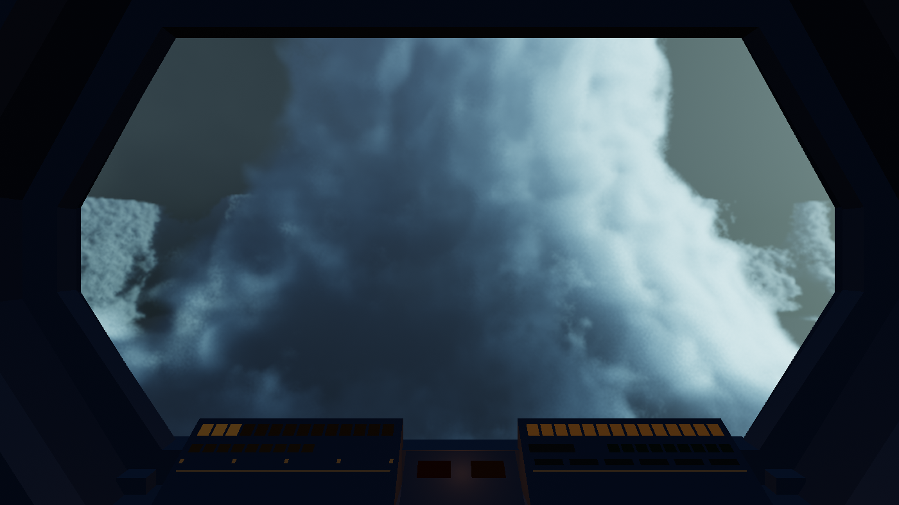
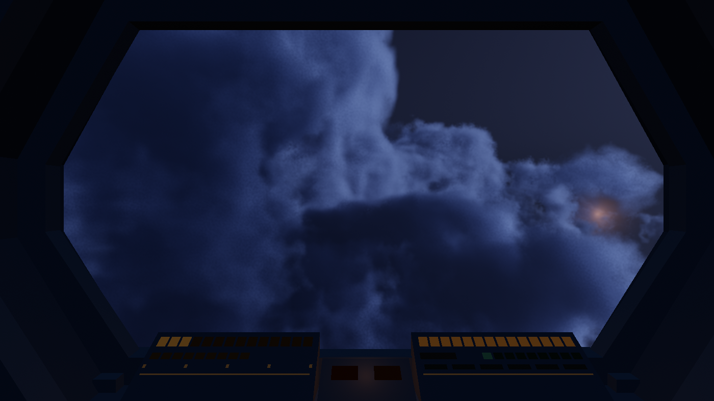
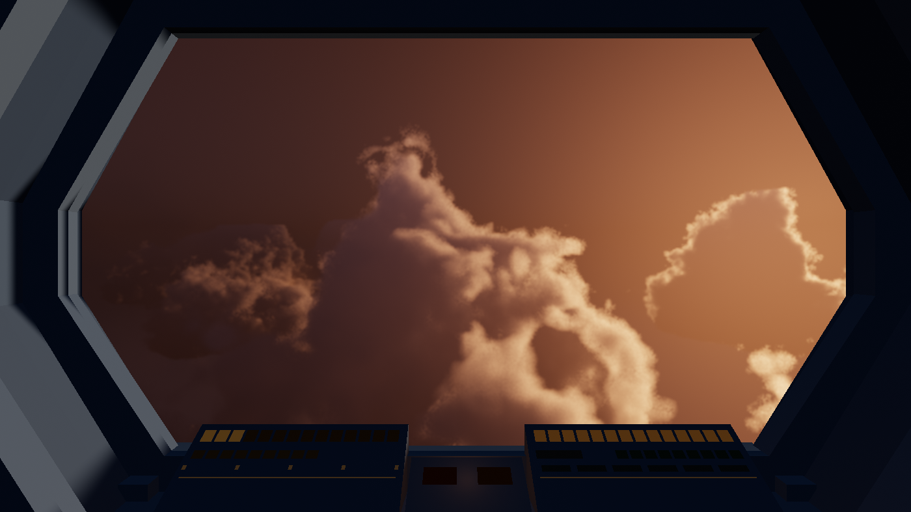
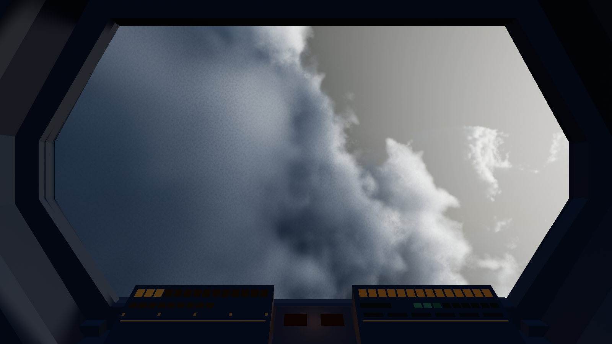
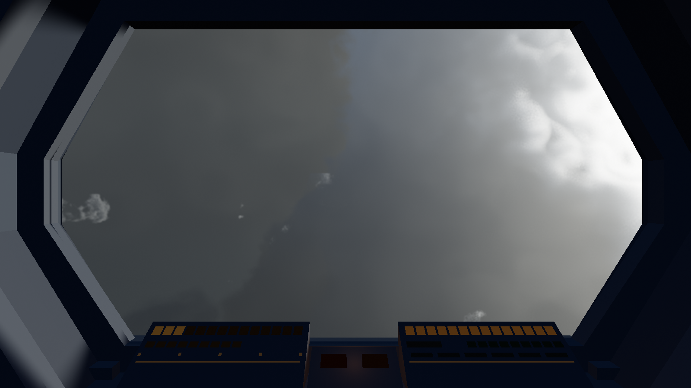
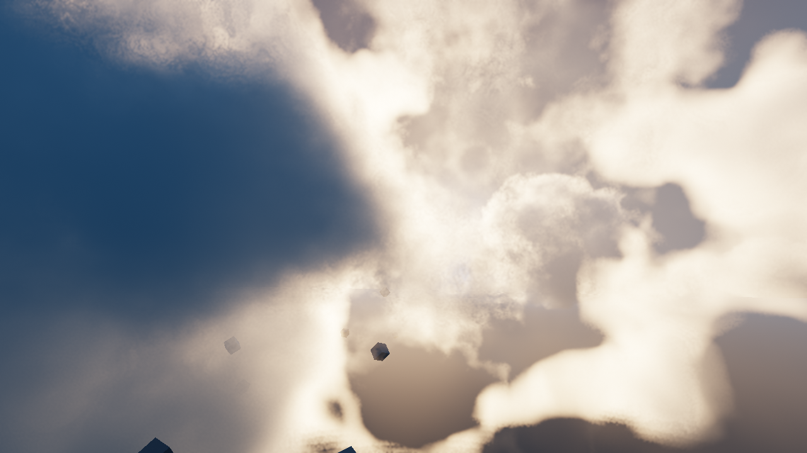
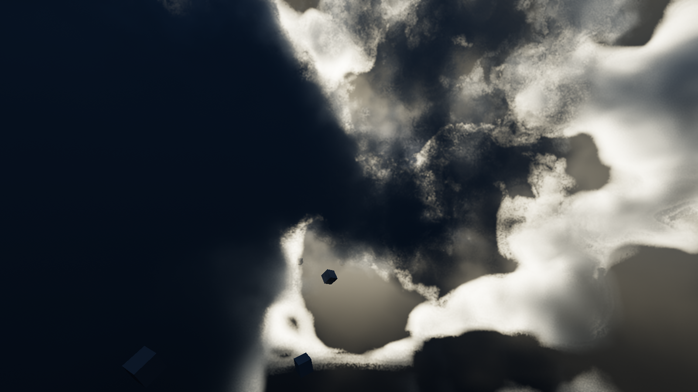
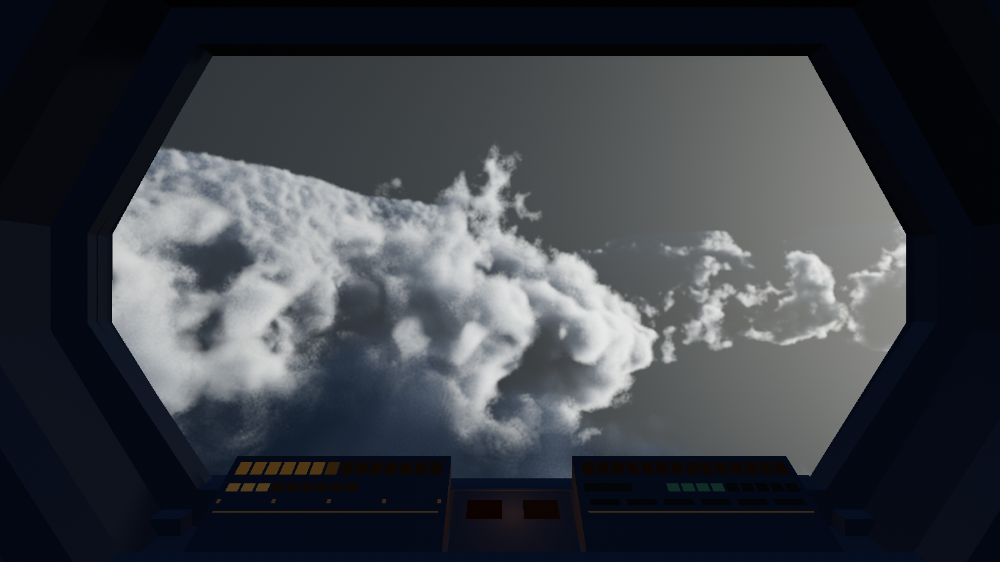
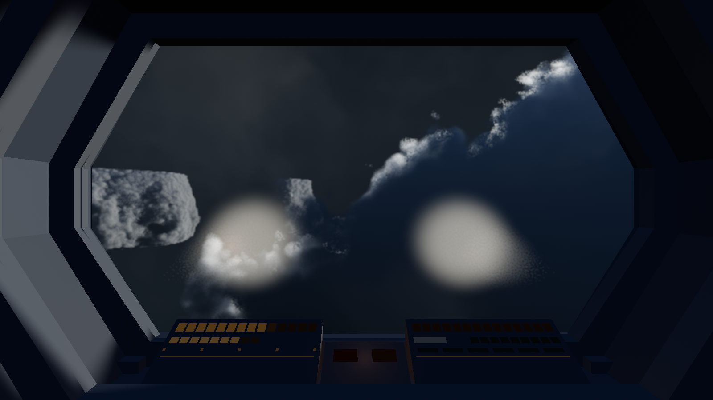
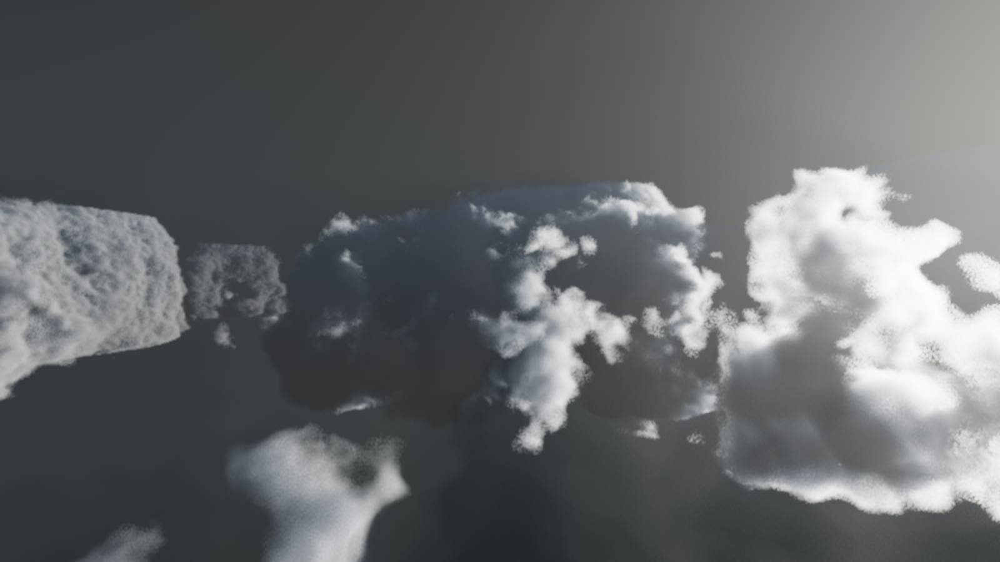

# Gallery

Captures from the running game, in the order the work happened. Every one is
produced by `GAME.capture()` — the simulation seeked to an exact tick and
rendered explicitly — so any of them can be reproduced byte-for-byte.

Start at **08–10**: the three luminaries. They are the biggest change to how the
game looks and the reason the rest of this page is already out of date.

---

## The luminaries

There is no sun. A single white key above white clouds is Earth, and it was what
the renderer had been quietly assuming — the key measured `[2.30, 2.24, 2.02]`,
white in all but name, and the frames it produced measured a **chroma of 0.055**,
which is grey. "Not generic grey fog" is the failure `ART_DIRECTION` names as the
most likely one, and a neutral light on a neutral medium is the shortest path to
it.

Three coloured sources now rise and set on long, mutually prime cycles, and the
whole palette — sky, haze, ambient, deep scattering — is derived from whichever
are up. Measured across a run, warmth now spans **−31.1 to +30.6**; before, the
light never changed at all.

### 08 — The Veil

Cold green-cyan, and the light most of the game happens under. The
"green-black of deep water" the art direction asks for.

### 09 — The Drown

Deep indigo, always present, never dominant. It exists so shadow is a *colour*
rather than an absence — a shadow lit by nothing is black, black has no hue, and
a frame whose dark half has no hue is halfway to grey whatever the lit half does.
The warm spark at the right is the ember setting behind the cloud: **warmth as an
event**, which is the whole rule.

### 10 — The Ember

Copper, dim, and up for about a third of its cycle. This is the palette shift
that means something: under it, everything the art direction reserves warmth for
— creature light, discharge, your own lamps — stops being distinguishable at a
glance, so the safest-looking hours are the ones where you can least trust your
eyes.

An earlier pass had this brighter and more golden. It measured well and rendered
a lovely amber sunset, which is beautiful and completely wrong; it was pushed
toward red and darkened until the frame reads as lit by something you would
rather was not there.

---

## Before the luminaries

Everything below predates them, so the colour is not current. They are kept
because what each one *shows* is still true.

### 01 — Sun shafts: lit face against shadow side

Sun in-scatter at 23× its previous strength, through the real gameplay camera.
The gain was only safe once the in-scatter was gated on local density: before
that, the mist integrated through empty air as readily as through vapour, and
anything strong enough to make a beam beside a cloud turned every open-sky frame
into a dust storm (47% of the frame blazing at gain 0.5, 99.9% at 1.6).

### 02 — Sun shafts: shadow wedge across lit vapour

The closest thing to a shaft in the build, and the honest limit of the approach.
From inside a cloud deck you look *along* the light, so cloud shadow reads as a
dark band in bright air rather than a bright beam in dark air. The poster image —
separated white rays — is what you see from *below and outside* the deck. This
game keeps the camera permanently inside the layer.

---

### 03 → 04 — The mood pass
| before | after |
|---|---|
|  |  |

Same camera, same sim time, same sun. Median luminance 190 → 36, dynamic range
1.31 → 6.75. The cause was not colour: `uSigmaT` was 0.045, thin enough to see
straight *through* a cloud into the sun, so nothing was blocking enough to carve
a shaft. At 0.16 it also renders faster, because opaque cloud terminates a ray
early.

### 05 — The cockpit

Real geometry welded to the ship, drawn into the same linear HDR buffer and tone
mapped with everything else. Wiring it revealed that the camera had been sitting
3.45 m *outside* the ship at cruise since the file was written — a first-order
position lag has steady-state error proportional to speed, and there had never
been any near geometry to notice it against.

### 06 — Lamps in the dark

The ship's own lights, splayed outward and drooped so the beams rake across cloud
instead of stacking into one disc down the view axis. A cone viewed from its own
apex is a disc, always — so the lamp's job here is to light the mass you are about
to fly into.

### 07 — Through the gameplay camera

Cloud with dark undersides and lit tops, at the altitude and coverage the mood
suite is measured against.
